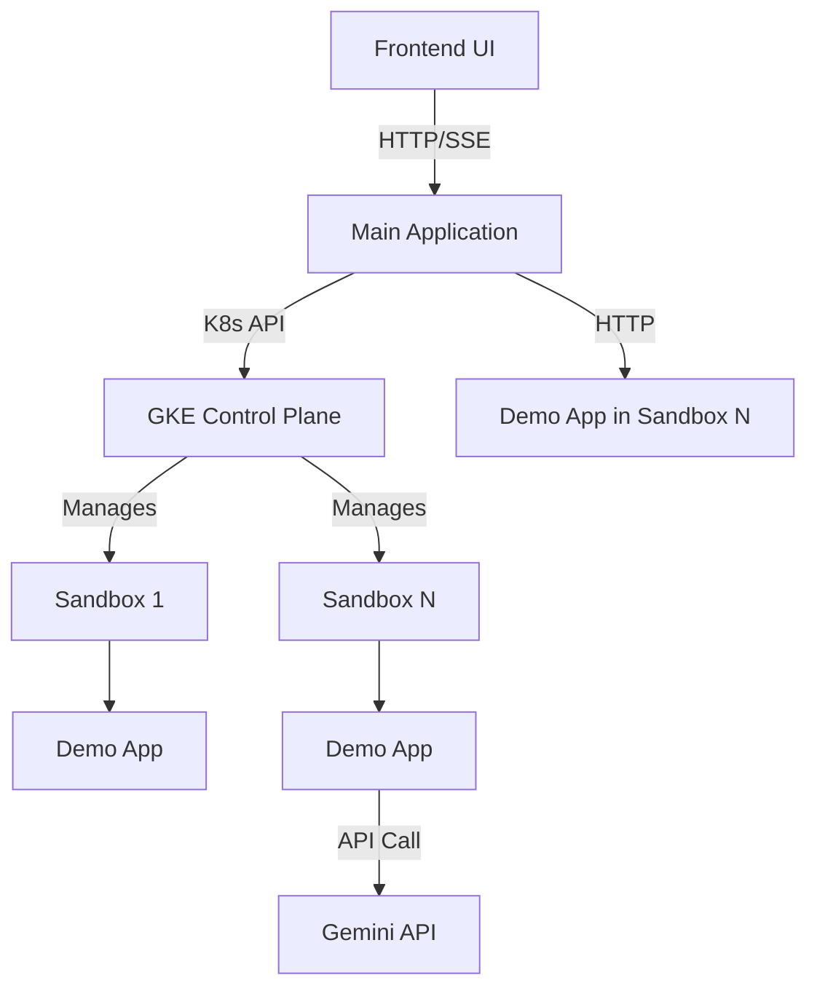

# Specification: GKE Agent Sandbox Management Application

## 1. Overview
This document outlines the specification for a multi-component application designed to demonstrate and manage AI agent sandboxes on Google Kubernetes Engine (GKE), leveraging the specialized **GKE Agent Sandbox** feature.

The system will consist of:
1.  **Main Application**: A central control plane (FastAPI) responsible for lifecycle management of sandboxes, routing messages, and interacting with the Kubernetes API.
2.  **Demo Application**: A lightweight service (FastAPI) that runs *inside* the provisioned sandboxes to simulate agent workloads.
3.  **Frontend UI**: A web interface for users to interact with the Main Application, visualize sandbox states, and trigger actions.
4.  **Infrastructure Code**: Scripts and manifests to provision the GKE cluster with the Agent Sandbox feature enabled and deploy the core components.

The core focus is on utilizing the sub-second provisioning and isolation capabilities of GKE Agent Sandbox to manage dynamic, short-lived or long-lived isolated environments for untrusted code execution or specific agent tasks.

---

## 2. System Architecture

The application follows a client-server architecture where the Main Application acts as the orchestrator between the user (via the UI) and the Kubernetes cluster where sandboxes are running.

### 2.1 Component Diagram (Conceptual)

### 2.2 Key Technologies
-   **Backend**: FastAPI (Python 3.11+)
-   **Frontend**: HTML, JavaScript (Vanilla or simple framework)
-   **Containerization**: Docker
-   **Orchestration**: Google Kubernetes Engine (GKE)
-   **Isolation**: GKE Agent Sandbox (gVisor/Kata)
-   **AI Integration**: Vertex AI SDK (for Gemini)

---

## 3. Main Application Specification

The Main Application is the heart of the system. It exposes a REST API (and potentially Server-Sent Events or WebSockets for real-time updates) and interacts directly with the Kubernetes cluster to manage custom resources or pods representing the sandboxes.

### 3.1 APIs and Endpoints

#### Sandbox Lifecycle Management
-   **POST `/api/sandboxes`**: Create a new sandbox.
    -   *Request*: Optional configuration (e.g., labels, specific image version).
    -   *Response*: `sandbox_id`, `status` (provisioning, active), `connection_info`.
    -   *Logic*:
        1.  Generate a unique Sandbox ID.
        2.  Call K8s API to create a `SandboxTemplate` instance or a Pod associated with the Agent Sandbox runtime class.
        3.  Pass the `Sandbox ID` as an environment variable to the container.
        4.  Track the mapping of Sandbox ID to K8s resource.

-   **GET `/api/sandboxes`**: List all managed sandboxes and their current state.
    -   *Response*: List of objects containing `sandbox_id`, `state` (Running, Sleeping, Provisioning, Error), `created_at`, `last_active`.

-   **GET `/api/sandboxes/{sandbox_id}`**: Get detailed status of a specific sandbox.

-   **POST `/api/sandboxes/{sandbox_id}/sleep`**: Move a sandbox to "sleep" mode.
    -   *Logic*: (See Section 6 for detailed discussion on Sleep/Wake behavior). This might involve scaling to 0 replicas or pausing the container if supported by the runtime, or deleting the Pod while retaining metadata.

-   **POST `/api/sandboxes/{sandbox_id}/wake`**: Wake up a sandbox from sleep mode.
    -   *Logic*: Recreate the Pod or restore it to active state.

#### Sandbox Communication and Actions
-   **POST `/api/sandboxes/{sandbox_id}/message`**: Send a message to the application running inside the sandbox.
    -   *Request*: `{ "message": "string" }`
    -   *Logic*:
        1.  Check the state of the sandbox.
        2.  If the sandbox is in `Sleeping` state, automatically trigger the **Wake** operation first and wait for it to become ready.
        3.  Route the HTTP request to the Demo App running inside the sandbox (using K8s service or direct Pod IP if accessible).
        4.  Return the response from the Demo App to the user.

-   **GET `/api/sandboxes/{sandbox_id}/quote`**: Request a Gemini quote from the sandbox.
    -   *Logic*: Similar to the message endpoint, route this request to the specific endpoint of the Demo App inside the sandbox.

### 3.2 State Management
The Main Application will maintain the state of sandboxes **In-Memory** (e.g., using a Python dictionary or list).
-   All state is lost when the application restarts.
-   Sandboxes can be considered transient and deleted/recreated when the application starts.

---

## 4. Demo Application Specification

The Demo Application runs inside the isolated sandbox environment. It must be lightweight to respect the sub-second provisioning goals of the GKE Agent Sandbox.

### 4.1 Environment Variables
-   **`SANDBOX_ID`**: A unique identifier provided by the Main Application during creation.
-   **Vertex API Access**: Authentication is handled via the account/Workload Identity. No explicit `GEMINI_API_KEY` is required.

### 4.2 APIs and Endpoints

-   **POST `/message`**: Reply with a modified message.
    -   *Request*: `{ "message": "string" }`
    -   *Response*: `{ "reply": "[SANDBOX_ID] string" }`
    -   *Example*: If input is "Hello" and `SANDBOX_ID` is `sb-123`, response is `"[sb-123] Hello"`.

-   **GET `/quote`**: Fetch a quote of the day using Gemini.
    -   *Logic*:
        1.  Initialize the Vertex AI / Gemini client.
        2.  Call a model (e.g., Gemini Flash) with a prompt like "Provide a short, inspiring quote of the day."
        3.  Return the text response.

-   **GET `/healthz`**: Simple health check endpoint for K8s liveness/readiness probes.

---

## 5. Frontend UI Specification

A sleek, modern web interface to interact with the Main Application.

### 5.1 Views and Layouts
-   **Dashboard**: A card-based or table grid showing all active and sleeping sandboxes.
    -   Each card displays: Sandbox ID, Status (with color indicator), Uptime.
    -   Quick action buttons on each card: Message, Quote, Sleep/Wake, Delete.
-   **Sandbox Detail View / Console**:
    -   A chat-like interface to send messages and see replies from a specific sandbox.
    -   A dedicated area to display the "Quote of the Day".
    -   A log viewer area showing interactions.

### 5.2 Dynamic Interactions
-   Use polling or Server-Sent Events (SSE) to update the sandbox list in real-time as statuses change (especially during provisioning and wake-up transitions).
-   Provide clear visual feedback when a sandbox is "waking up" before a message is delivered.

---

## 6. Detailed Workflow: Sleep and Wake

The "Sleep" and "Wake" functionality is non-trivial in a standard Kubernetes environment and requires specific design choices when mapping to GKE Agent Sandbox.

### 6.1 Documentation Guidelines
The implementation must follow the **GKE Agent Sandbox** documentation strictly, as described in the provided links:
-   `https://clouddocs.devsite.corp.google.com/kubernetes-engine/docs/how-to/agent-sandbox`
-   `https://clouddocs.devsite.corp.google.com/kubernetes-engine/docs/how-to/how-install-agent-sandbox`

We will not invent the sandbox technology or the sleep/wake mechanism. We will use the mechanisms described in the documentation (e.g., using `SandboxTemplate` or specific APIs provided by the feature).

> [!IMPORTANT]
> Since the assistant cannot access the internal `corp.google.com` links, the user must provide the specific details regarding the sandbox lifecycle management and sleep/wake implementation described in those documents.

### 6.2 Auto-Wake on Message Workflow
1.  User sends message to Main App for Sandbox `X`.
2.  Main App checks database/K8s: Sandbox `X` is in `Sleeping` state.
3.  Main App triggers the creation of a new Pod for Sandbox `X` (or pulls from the warm pool).
4.  Main App waits (polling or watching K8s events) until the new Pod is `Ready`.
5.  Main App forwards the user's message to the new Pod's IP/Service.
6.  User receives the response transparently (with some added latency for the wake-up step).

---

## 7. Infrastructure and Deployment (Focus on Sandbox)

The core requirement is to enable and use the **GKE Agent Sandbox**.

### 7.1 Infrastructure Script (`build_infra.sh`)
This script will use `gcloud` to:
1.  Create a GKE cluster with the specific channel/version that supports Agent Sandbox.
2.  Enable the Agent Sandbox add-on (if distinct from standard sandbox).
3.  Configure node pools. If Agent Sandbox requires specific node types or TAs (Trusted Execution Environments) like confidential nodes, the script must handle this.
4.  (Optional) Configure a **Warm Pool** length if supported by the CRDs.

### 7.2 Kubernetes Manifests
-   **`main-app-deployment.yaml`**: Standard deployment for the Main App.
-   **`sandbox-template.yaml`**: The definition of the `SandboxTemplate` or equivalent CRD that the Main App will use to stamp out new sandboxes. This will specify:
    -   The Demo App Docker image.
    -   The `runtimeClassName` associated with the sandbox (e.g., `gvisor` or `agent-sandbox`).
    -   Environment variable placeholders (to be filled by the Main App).

---

## 8. Clarification Questions and Documentation Requests

Since we need to follow the specific GKE Agent Sandbox documentation strictly and I cannot access internal Google Cloud documentation URLs, please provide the following information from those guides:

1.  **Sandbox Creation**: How are sandboxes created and managed according to the guide? Is it via a Custom Resource (e.g., `SandboxTemplate`), or by creating standard Pods with a specific `runtimeClassName`?
2.  **Sleep and Wake**: What is the recommended or documented way to put a sandbox to sleep and wake it up? Does the feature provide an API for this, or do we use standard Kubernetes mechanisms like scaling?
3.  **Authentication**: Confirmation on whether any special configuration is needed for the Demo App to access Vertex AI APIs when running inside the sandbox (e.g. Workload Identity setup specific to Agent Sandbox).
